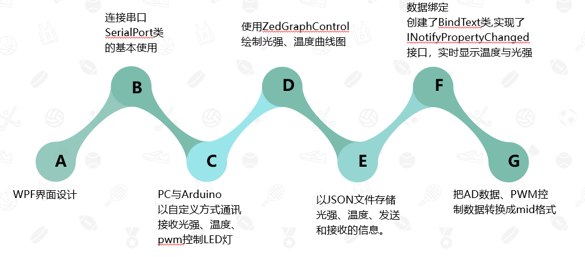
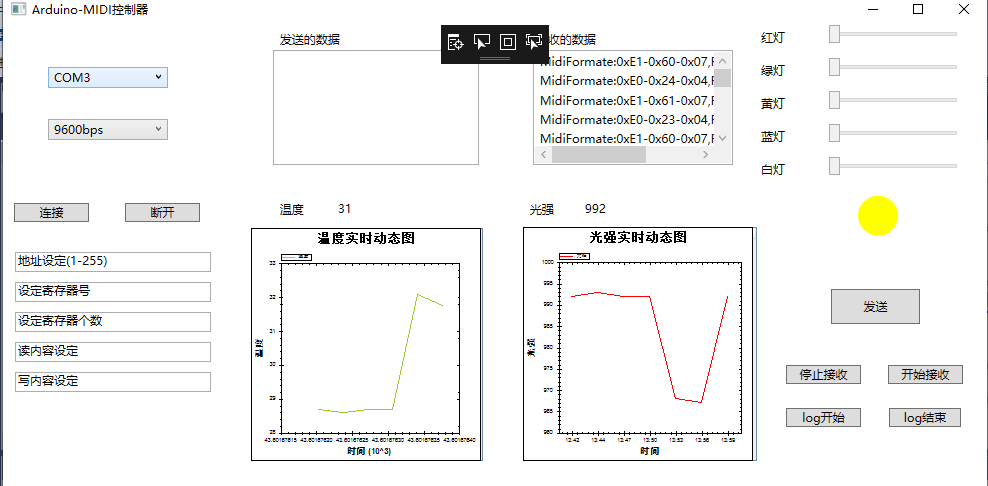
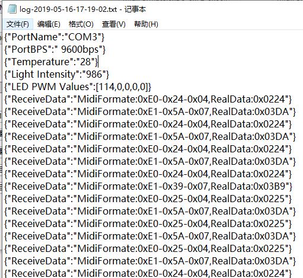

## C# .NET 综合应用程序开发
      学院：软件学院  班级：4 班    学号：3017218181  姓名：郑万杰
      日期：   2019年  4月 18 日
# 一、功能概述
      使用串口编程，设计APP实现如下功能：
	  1.可以与Arduino进行通信，PC与Arduino进行数据交换（光强、温度）
	  2.数据交换的格式采用midi格式
	  3.可以控制与Arduino相连的5个LED灯的亮度
# 二、项目特色
    1.可以以JSON格式的数据记录日志
    2.将5个LED灯的颜色进行混合显示
	3.将光强跟温度数据的信息构建曲线图实时显示更新，光强和温度实时更新
	4.可以控制是否接收数据
# 三、代码总量
     300行。
# 四、工作时间
     3天
# 五、知识图总结
 
# 六、运行截图以及电路图
     ## 电路图

	 ## 运行截图

	 ## 日志文件

# 六、结论
    通过这次实验，收获了很多。第一次利用C#完成了一个完整的wpf应用程序，将之前学过的内容进行了综合，涉及到了多方面的内容，包括界面设计、文件操作、事件处理、数据绑定、Arduino编程、电路连接、mid格式的数据的传输等内容，综合性比较强。另外，这次实验也让我理解了mid格式的数据的实现方式。还有就是学到一个解决问题的思路，去查找英文资料，这个思路不是重点，重点是这次实验告诉我，以后要好好学英语。 
